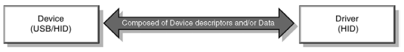
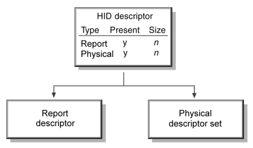
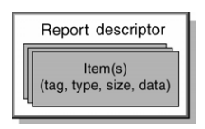
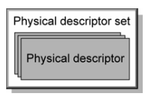
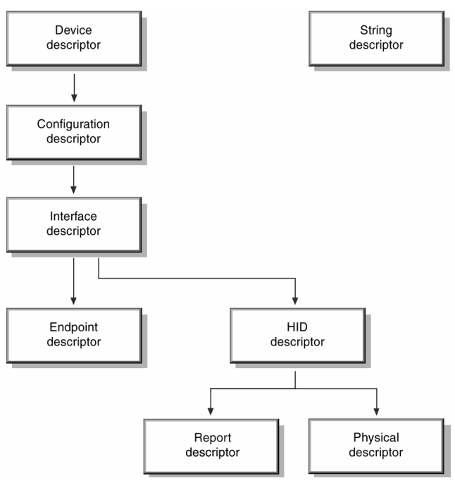

# 3. Management Overview

- Information about a USB device is stored in segments of its ROM (read-only memory).

- These segments are called descriptors.

- An interface descriptor can identify a device as belonging to one of a finite number of classes.

- The HID class is the primary focus of this document.

 

- A USB/HID class device uses a corresponding HID class driver to retrieve and route all data.

 

- The routing and retrieval of data is accomplished by examining the descriptors of the device and the data it provides.

- The HID class device descriptor identifies which other HID class descriptors are present and indicates their sizes.

- For example, Report and Physical Descriptors.

- A Report descriptor describes each piece of data that the device generates and what the data is actually measuring.

- For example, a Report descriptor defines items that describe a position or button state.

- Item informataion is used to:

    - Determine where to rout input -- for example, send input to mouse or joystick API

    - Allow software to assign functionality to input -- for example, use joystick input to position a tank.
- By examining an items (collectively called the Report descriptor) the HID class driver is able to determine the size and composition of data reports from the HID class device.

- Physical descriptor sets are optional descriptors which provide information about the part or parts of the human body used to activate the controls on a device.

- All of these things can be combined to illustrate the descriptor structure.

- The rest of this specification documents the implementation details, caveats, and restrictions for developing HID class devices and drivers.
