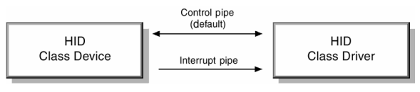

# 4. Functional Characteristics

- This section describes the functional characteristics of the HID:

    - Class

    - Subclass

    - Interfaces

## 4.1 The HID Class

- USB devices are segmented into device classes that:

    - Have similar data transport requirements.

    - Share a single class driver.

 

- For example, Audio class devices require isochronous data pipes.

- HID class devices have different (and much simpler) transport requirements.

- The transport requirements for HID class devices are identified in this document.

> ##### Note
>
> - USB devices with data requirements outside the range of defined classes must provide their own class specifications and drivers as defined by the USB Specification.
>
> - See Section 2.3: Related Documents.

- A USB device may be a single class type or it may be composed of multiple classes.

- For example, a telephone hand set might use features of the HID, Audio, and Telephony classes.

- This is possible because the class is specified in the Interface descriptor and not the Device descriptor.

- This is discussed further in Section 5.1: Device Descriptor Structure.

 

- The USB Core Specification defines the HID class code.

- The *bInterfaceClass* member of an Interface descriptor is always 3 for HID class devices.

> ##### See Also
>
> - The Audio Class Specification defines audio device transport requirements in greater detail.
>
> - See Section 2.3: Related Documents.

## 4.2 Subclass

- During the early development of the HID specification, subclasses were intended to be used to identify the specific protocols of different types of HID class devices.

- While this mirrors the model currently in use by the industry (all devices use protocols defined by similar popular devices), it quickly became apparent that this approach was too restrictive.

- That is, devices would need to fit into narrowly defined subclasses and would not be able to provide any functionality beyond that supported by the subclass.

 

- The HID committee agreed on the improbability that subclass protocols for all possible (and yet to be conceived) devices could be defined.

- In addition, many known devices seemed to straddle multiple classifications -- for example, keyboards with locators, or locators that provided keystrokes.

- Consequently, the HID class does not use subclasses to define most protocols.

- Instead, a HID class device identifies its data protocol and the type of data provided within its Report descriptor.

 

- The Report descriptor is loaded and parsed by the HID class driver as soon as the device is detected.

- Protocols for existing and new devices are created by mixing data types within the Report descriptor.

> ##### Note
>
> - Because the parser for the Report descriptor represents a significant amount of code, a simpler method is needed to identify the device protocol for devices requiring BIOS support (Boot Devices).
>
> - HID class devices use the Subclass part to indicate devices that support a predefined protocol for either mouse devices or keyboards (that is, the device can be used as a Boot Device).
>
> - The boot protocol can be extended to include additional data not recognized by the BIOS, or the device may support a second preferred protocol for use by the HID class driver.

- The *bInterfaceSubClass* member declares whether a device supports a boot interface, otherwise it is 0.

### Subclass Codes

|bSubclass Code|Descriptionb|
|-|-|
|0|No Subclass|
|1|Boot Interface Subclass|
|2 - 255|Reserved

> ##### See Also
>
> - Boot Report descriptors are listed in Appendix B: Boot Interface Descriptors.
>
> - For HID subclass and protocol codes, see Appendix E: Example USB Descriptors for HID Class Devices.

## 4.3 Protocols

- A variety of protocols are supported HID devices.

- The *bInterfaceProtocol* member of an Interface descriptor only has meaning if the *bInterfaceSubClass* member declares that the device supports a boot interface, otherwise it is 0.

### Protocol Codes

|Protocol Code|Description|
|-|-|
|0|None|
|1|Keyboard|
|2|Mouse|
|3 - 255|Reserved|

## 4.4 Interfaces

- A HID class device communicates with the HID class driver using either the Control (default) pipe or an Interrupt pipe.

- The Control pipe is used for:

    - Receiving and responding to requests for USB control and class data.

    - Transmitting data when polled by the HID class driver (using the Get_Report request
.
    - Receiving data from the host.

 

- The Interrupt pipe are used for:

    - Receiving asynchronous (unrequested) data from the device.

    - Transmitting low latency data to the device.

- The Interrupt Out pipe is optional.

- If adevice declares an Interrupt Out endpointthen Output reports are transmitted by the host to the device through the Interrupt Out endpoint.

- If no Interrupt Out endpoint is declared then Output reports are transmitted to a device through the Control endpoint, using Set_Report(Output) requests.

> ##### Note
>
> - Endpoint 0 is a Control pipe always present in USB devices.
>
> - Therefore only the Interrupt In pipe is described for the Interface descriptor using an Endpoint descriptor.
>
> - In fact, several Interface descriptors may share Endpoint 0.
>
> - An Interrupt Out pipe is optional and requires an additional Endpoint descriptor if declared.

|Pipe|Description|Required|
|-|-|-|
|Control (Endpoint 0)|USB control, class request codes, and polled data (Message data).|Y|
|Interrupt In|Data in, that is, data from device (Stream data)|Y|
|Interrupt Out| Data out, that is, data to the device (Stream data).|N|

> ##### See Also
>
> - For details about the Control pipe, see the USB Specification.
>
> - See Section 2.3: Related Documents.

## 4.5 Device Limitations

- This specification applied to both high-speed and low-speed HID class devices.

- Each type of device possesses various limitations, as defined in Chapter 5 of the Universal Serial Bus Specification.
