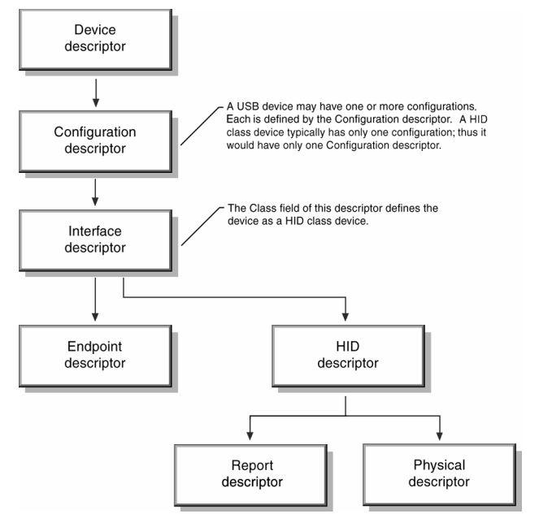
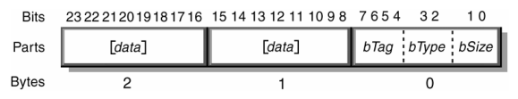
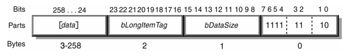
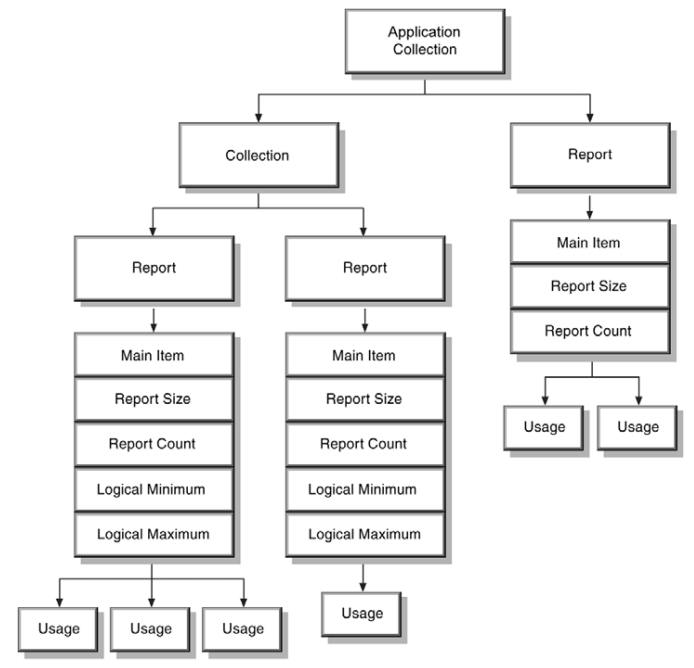
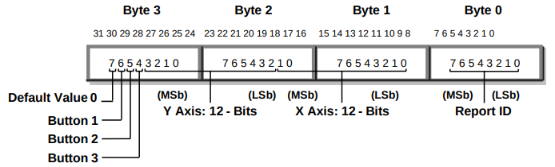

# 5. Operational Model

- This section outlines the basic operational model of a HID class device.

- Flowchart elements represent tables of information with the firmware.

## 5.1 Device Descriptor Structure

- At the topmost level, a descriptor includes two table of information referred to as the Device descriptor and String descriptor.

- A standard USB Device descriptor specifies the Product ID and other information about the device.

- For example, Device descriptor fields primarily include:

    - Class

    - Subclass

    - Vendor

    - Product

    - Version



- For HID class device devices, the:

    - Class type is not defined at the Device descriptor level.

        - The class type for a HID class device is defined by the Interface descriptor.

    - Subclass field is used to identify Boot Devices.

> ##### Note
>
> - The *bDeviceClass* and *bDeviceSubClass* fields in the Device Descriptor should not be used to identify a device as belonging to the HID class.
>
> - Instead use the *bInterfacseClass* and *bInterfaceSubClass* fields in the Interface descriptor.

> ##### See Also
>
> - The HID class driver identifies the exact type of device and features by examining additional class-specific descriptors.
>
> - For more information, see Section 6.2: Class-Specific Descriptors.
>
> - For methods for descriptor retrieval, see Section 7: Requests.

## 5.2 Report Descriptors

- Preceding descriptors are illustrated by flowchart items that represent tables of information.

- Each table of information can be thought of as a block of data.

- Instead of a block of data, Report descriptors is called an Item.

## 5.3 Generic Item Format

- An item is piece of information about the device.

- All items have a one-byte prefix that contains the item tag, item type, and item size.



- An item may include optional item data.

- The size of the data portion of an item is determined by its fundamental type.

- There are two basic types of items: short items and long items.

- If the item is a short item, its optional data size may be 0, 1, 2, or 4 bytes.

- If the item is a long item, its *bSize* value is always 2.

- The following example illustrates possible values within the 1-byte prefix for a long item.



## 5.4 Item Parser

- The HID class driver contains a parser used to analyze items found in the Report descriptor.

- The parser collects the state of each known item as it walks through the descriptor, and stores them in an item state table.

- The item state table contains the state of individual items.

<br>

- From the parser's point of view, a HID class device looks like the following figure:



- When some items are encountered, the contents of the item state table are moved.

- These items include all Main, Push, and Pop items.

    - When a Main item is found, a new report structure is allocated and initialized with the current item state table.

        - All Local items are then removed from the item state table, but Global items remain.

        - In this way, Global items set the default vlue for subsequent new Main items.

        - A device with several similar controls -- for example, six axes -- would need to define the Global items only once prior to the first Main item.

        > ##### Note
        >
        > - Main items are associated with a collection by the order in which they are declared.
        >
        > - A new collection starts when the parser reaches a Collection item.
        >
        > - The item parser associates with a collection all Main items defined between the Collection item and the next End Collection item.

    - When a Push item is encountered, the item state table is copied and placed on a stack for later retrieval.

    - When a Pop item is found, the item state table is replaced with the top table from the stack.

        - For example:

            ```
            Unit (Meter), Unit Exponent (-3), Push, Unit Exponent (0)
            ```

        <br>

        - When the parser reaches a Push item, it places the items defining units of millimeters on the stack.

        - The next item changes the item state table to units of meters.

        <br>

        - The parser is required to parse through the whole Report descriptor to find all Main items.

        - This is necessary in order to analyze reports sent by the device.

> 

> ##### See Also
>
> - For details, see Section 8: Report Protocol.

## 5.5 Usages

- Usages are part of the Report descriptor and supply an application developer with information about what a control is actually measuring.

- In addition, a Usage tag indicates the vendor's suggested use for a specific control or group of controls.

- While Report descriptors describe the format of the data -- for example, three 8-bit fields -- a Usage tag defines what should be done with the data --for example, x, y, and z input.

- This feature allows a vendor to controls across applications.

<br>

- A Report descriptor can have multiple Usage tags.

- There is one-to-one correspondence between usages and controls, one usage control defined in the descriptor.

- An array indicates that each field of a Report descriptor represents several physical controls.

- Each control may have attributes such as a usage assigned to it.

- For example, an array of four buttons could have a unique Usage tag for each button.

<br>

- A Usage is interpreted as a 32 bit unsigned value where the high order 16 bits defines the Usage Page and the low order 16 bits defines a Usage ID.

- Usage IDs are used to select individual Usage on a Usage Page.

> ##### See Also
>
> - For an example, see Appendix E. 10: Report Descriptor (Mouse).

## 5.6 Reports

- Using USB terminology, a device may send or receive a transaction every USB frame (1 millisecond).

- A transaction may be made up of multiple packets (token, data, handshake) but is limited in size to 8 bytes for low-speed devices and 64 bytes for high-speed devices.

- A transfer is one or more transactions creating a set of data that is meaningful to the device -- for example, Input, Output, and Feature reports.

- In this document, a transfer is synonymous with a report.

<br>

- Most devices generate reports, or transfers, by returning a structure in which each data field is sequentially represented.

-  However, some devices may have multiple report structures on a single endpoint, each representing only a few data fields.

- For example, a keyboard with an integrated pointing device could independently report "key press" data and "pointing" data over the same endpoint.

- Report ID items are used to indicate which data fields are represented in each report structure.

- A Report ID item tag assigns 1-byte identification prefix to each report transfer.

- If no Report ID item tags are present in the Report descriptor, it can be assumed that only one Input, Output, and Feature report structure exists and together they represent all of the device's data.

> ##### Note
>
> - Only Input reports are sent via the Interrupt In pipe.
>
> - Feature and Output reports must be initiated by the host via the Control pipe or an optional Interrupt Out pipe.

- If a device has multiple report structures, all data transfer s start with a 1-byte identifier prefix that indicates which report structure applies to the transfer.

- This allows the class driver to distinguish incoming pointer data from keyboard data by examining the transfer prefix.

## 5.7 Strings

- A collection or data field can have a particular label (string index) associated with it.

- Strings are optional.

<br>

- The Usage tag of an item is not necessarily the same as a string associated with the Main item.

- However, strings may be useful when a vendor-defined usage is required.

- The String descriptor contains a list of text strings for the device.

> ##### See Also
>
> - For details, see Appendix E: Example USB Descriptors for HID Class Devices.

## 5.8 Format of Multibyte Numeric Values

- Multibyte numeric values in reports are represented in little-endian format, with the least significant byte at the lowest address.

- The Logical Minimum and Logical Maximum values identify the range of values that will be found in a report.

- If Logical Minimum and Logical Maximum are both positive values then a sign bit is unnecessary in the report field and the contents of a field can be assumed to be an unsigned value.

- Otherwise, all integer values are signed values represented in 2's complement format.

- Floating point values are not allowed.

<br>

- The least significant bit in a value is stored in bit 0, the next more significant in bit 1 and so on up to the size of the value.

- The following example illustrates bit

    

    - representation of a long integer value.

## 5.10 Null Values

- HID class devices support the ability to ignore selected fields in a report at runtime.

- This is accomplished by declaring bit field in a report that is capable of containing a range of values larger than those actually generated by the control.

- If the host or the device receives an out-of-range value then the current value for the respective control will not be modified.

<br>

- A hardware developer must carefully evaluate the controls in an individual report to determine how an application on the host will use them.

- If there are any situations in which an application will not modify a particular field every time the report is sent to the device, then the field should provide a Null value.

- With Null values, the host can initialize all fields in a report that it does not wish to modify to their null (out-of-range) value and set the fields that it wishes to modify to valid (in-range) values.

<br>

- The initialization of null values in a report is much easier if they are all the same.

<br>

- NOTE: It is *highly recommended* that 0 be included in the set of Null values so that report buffers can simply be set to zero to establish the "don't care" state for all fields.
