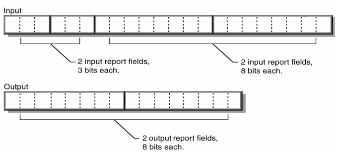

# 6. Descriptors

## 6.1 Standard Descriptors

- The HID class device class uses the following standard USB descriptors:

    - Device

    - Configuration

    - Interface

    - Endpoint

    - String

> ##### See Also
>
> - For details about these descriptors as defined for a HID class device, see Appendix E: Example USB Descriptors for HID Class Devices.
>
> - For general information about standard USB descriptors, see Chapter 9 of the USB Specification, "USB Device Framework."

## 6.2 Class-Specific Descriptors

- Each device class includes one or more class-specific descriptors.

- These descriptors differ from standard USB descriptors.

- A HID class device uses the following class-specific descriptors:

    - HID

    - Report

    - Physical

### 6.2.1 HID Descriptor

#### Description

- The HID descriptor identifies the length and type of subordinate descriptors for a device.

### 6.2.2 Report Descriptor

- The Report descriptor is unlike other descriptors in that it is not simply a table of values.

- The length and content of a Report descriptor vary depending on the number of data fields required for device's report or reports.

- The Report descriptor is made up of items that provide information about the device.

- The first part of an item contains three fields: item  type, item tag, and item size.

- Together these fields identify the kind of information the item provides.

<br>

- There are three item types:

- Main, Global, and Local.

- There are five Main item tags currently defined:

    - Input item tag:

        - Referes to the datafrom one or more similar controls a device.

        - For example, variable data such as reading the position of a single axis or a group of levers or arraydata such as one or more push buttons or switches.

    - Output item tag:

        - Refers to the data to one or more similar controls on a device such as setting the position of a single axis ore a group of levers (variable data).

        - Or, it can represent data to one ore more LEDs (array data).

    - Feature item tag:

        -  Describes device input and output not intended for consumption by the end user -- for example, a software feature or Control Panel toggle.

    - Collection item tag:

        - A meaningful grouping of Input, Output, and Feature items -- for example, mouse, keyboard, joystick, and pointer.

    - End Collection item tag:

        - A terminating item used to specifythe endof a collection of items.

<br>

-The Report descriptor provides a description of the data provided by each control in a device.

- Each Main item tag (Input, Output, or Feature) identifies the size of the data returned by a particular control, and identifies whether the data is absolute or relative , and other pertinent information.

- Preceding Local and Global items define the minimum and maximum data values, and so forth.

- A Report descriptor is the complete set of all items for a device.

- By looking at a Report descriptor alone, an application knows how to handle incoming data, as well as what the data could be used for.

<br>

- One ore more fields of data from controls are defined by a Main item and further described by the preceding Global and Local items.

- Local items only describe the data fields defined by the next Main item.

- Global items become the default attributes for all subsequent data fields in that descriptor.

- For example, consider the following (details omitted for brevity):

    ```
    Report Size (3)
    Report Count (2)
    Input
    Report Size (k)
    Input
    Output
    ```

- The item parser interprets the Report descriptor items above and creates the following reports (the LSB is on the left):



- A Report descriptor may contain several Main items.

- A Report descriptor must include each of the following items to describe a control's data (all other items are optional):

    - Input (Output or Feature)

    - Usage

    - Usage Page

    - Logical Minimum

    - Logical Maximum

    - Report Size

    - Report Count

#### 6.2.2.1 Items Types and Tags

- All items contain a 1-byte prefix which denotes the basic type of the item.

- The HID class defines two basic formats for items:

    - Short items:

        - 1-5 bytes total length; used for the most commonly occuring items.

        - A short item typically contains 1 or 0 bytes of optional data.

    - Long items: 3-258 bytes in length; used for items that require larger data structures for parts.

> ##### Note
>
> - This specification defined only items that use the short format.
>
> - The two item formats should not be confused with types of items such as Main, Global, and Local.

> ##### See Also
>
> - For overview information, see Section 5.3: Generic Item Format.

#### 6.2.2.2 Short items

##### Description

- The short item format packs the item size, type, and tag into the first byte.

- The first byte may be followed by 0, 1, 2, or 4 optional data bytes depending on the sizef of the data.


- *bSize*: Numeric expression specifying size of data:

    - 0 = 0bytes, 1 = 1 byte, 2 = 2 bytes, 3 = 4 bytes

- *bType*: Numeric expression identifying type of item where:

    - 0 = Main, 1 = Global, 2 = Local, 3 = Reserved

- *bTag*: Numeric expression specifying the funcction of the item.

- [*data*]: Optional data.

##### Remarks

- A short item tag doesn't have an explicit value for *bSize* associated with it.

    - Instead, the value of the item data part determines the size of the item.

    - That is, if the item data can be represented in one byte, then the *data* part can be specified as 1 byte, although this is not required.

- If a large data item is expected, it can still be abbreviated if all of its high-order bits are zero.

    - For example, a 32-bit part in which bytes 1, 2, and 3 are all 0 can be abbreviated as a single byte.

- There are three categories of short item tags: Main, Global, and Local.

    - The item type (*bType*) specifies the tag category and consequently the item's behavior.

#### 6.2.2.4 Main items

##### Description

- Main items are used to either define or group certain types of data fields within a Report descriptor.

- There are two types of Main items: data and non-data.

- Datatype Main items are used to create a field within a report and include Input, Output, and Feature.

- Other items do not create fields and are subsequently referred to as non-data Main items.

##### Parts

|Main item tag|One-Byte Prefix (*nn* represents size value)|
|-|-|
|Input|1000 00 *nn*|
|Collection|1010 00 *nn*|
|End Collection|1100 00 *nn*|

##### Remarks

- The default data value for all Main items is zero (0).

- An Input item could have a data size of zero bytes (0) bytes.

    - In this case the value of each data bit for the item can be assumed to be zero.

- This is functionally identical to using a item tag that specifies a 4-byte data item followed by four zero bytes.

#### 6.2.2.5 Input, Output, and Feature Items

- Input, Output, and Feature items are used to create data fields within a report.

    - An Input item describes information about the data provided by one or more physical controls.

        - An application can use this information to interpret the data provided by the device.

        - All data fields defined in a single item share an identical data format.

    - The Output item is used to define an output data field in a report.

        - This item is similar to an Input item except it describes data sent to the device—for example, LED states.

    - Feature items describe device configuration information that can be sent to the device.

##### Parts

|Bit 0|Part|Value|
|-|-|-|
|0|Data \| Constant|0 \| 1|
|1|Array \| Variable|0 \| 1|
|2|Absolute \| Relative|0 \| 1|

###### Bit 0

- Indicates whether the item is data or a constant value.

- Data indicates the item is defining report fields that contain modifiable device data.

- Constant indicates the item is a static read-only field in a report and cannot be modified (written) by the host.

###### Bit 1

- Indicates whether the item creates variable or array data fields in reports.

- In variable fields, each field represents data from a physical control.

- The number of bits reserved for each field is determined by preceding Report Size/Report Count items.

- For example, a bank of eight on/off switches could be reported in 1 byte declared by a variable Input item where each bit represents one switch, on (1) or off (0) (Report Size = 1, Report Count = 8).

<br>

- An array provides an alternate means for describing the data returned from a group of buttons.

- Arrays are more efficient, if less flexible than variable items.

- Rather than returning a single bit for each button in the group, an array returns an index in each field that corresponds to the pressed button (like keyboard scan codes).

- An out-of-range value in and array field is considered no controls asserted.

- Buttons or keys in an array that are simultaneously pressed need to be reported in multiple fields.

- Therefore, the number of fields in an array input item (Report Count) dictates the maximum number of simultaneous controls that can be reported.

- A keyboard could report up to three simultaneous keys using an array with three 8-bit fields (Report Size = 8, Report Count = 3).

- Logical Minimum specifies the lowest index value returned by the array and Logical Maximum specifies the largest.

- The number of elements in the array can be deduced by examining the difference between Logical Minimum and Logical Maximum (number of elements = Logical Maximum - Logical Minimum + 1).

###### Bit 2

- Indicates whether the data is absolute (based on a fixed origin) or relative (indicating the change in value from the last report).

- Mouse devices usually provide relative data, while tablets usually provide absolute data.

##### Remarks

- If the Input item is an array, only the Data/Constant, Variable/Array and Absolute/Relative attributes apply.

- The value returned by an Array item is an index so it is recommended that:

    1. An Array field returns a 0 value when no controls in the array are asserted.

    2. The Logical Minimum equals 1.

    3. The Logical Maximum equal the number of elements in the array.

- Input items define input reports accessible via the Control pipe with a Get_Report (Input) request.

- Input type reports are also sent at the polling rate via the Interrupt In pipe.

#### 6.2.2.6 Collection, End Collection Items

##### Description

- A Collection item identifies a relationship between two or more data (Input, Output, or Feature.)

- For example, a mouse could be described as a collection of two to four data (x, y, button 1, button 2).

- While the Collection item opens a collection of data, the End Collection item closes a collection.

##### Parts

|Type of collection|Value|
|-|-|
|Application|0x01|

###### Application

- A group of Main items that might be familiar to applications.

- It could also be used to identify item groups serving different purposes in a single device.

- Common examples are a keyboard or mouse.

- A keyboard with an integrated pointing device could be defined as two different application collections.

- Data reports are usually (but not necessarily) associated with application collections (at least one report ID per application).

##### Remarks

- All Main items between the Collection item and the End Collection item are included in the collection.

    - Collections may contain other nested collections.

- Collection items do not generate data.

    - However, a Usage item tag must be associated with any collection (such as a mouse or throttle)

    - Caollection items may be nested, and they are always optional, except for top-level application collection.

#### 6.2.2.7 Global Items

##### Description

- Global items describe rather than define data from a control.

- A new Main item assumes the characteristics of the item state table.

- Global items can change the state table.

- As a result Global item tags apply to all subsequently defined items unless overridden by another Global item.

##### Parts

|Global item tag|One-Byte Prefix (*nn* represents size value)|
|-|-|
|Usage Page|0000 01 *nn*|
|Logical Minimum|0001 01 *nn*|
|Logical Maximum|0010 01 *nn*|
|Report Size|0111 01 *nn*|
|Report Count|1001 01 *nn*|

###### Usage Page

- Unsigned integer specifying the current Usage Page.

- Since a usage are 32 bit values, Usage Page items can be used to conserve space in a report descriptor by setting the high order 16 bits of a subsequent usages.

- Any usage that follows which is defines 16 bits or less is interpreted as a Usage ID and concatenated with the Usage Page to form a 32 bit Usage.

###### Logical Minimum

- Extent value in logical units.

- This is the minimum value that a variable or array item will report.

###### Logical Maximum

- Extent value in logical units.

- This is the maximum value that a variable or array item will report.

###### Report Size

- Unsigned integer specifying the size of the report fields in bits.

- This allow the parser to build an item map for the report handler to use.

- For more information, see Section 8: Report Protocol.

###### Report Count

- Unsigned integer specifying the number of data fields for the item; determines how many fields are included in the report for this particular item (and consequently how many bits are added to the report).

> ##### See Also
>
> - For a list of Usage Page tags, see the HID Usage Table document.

##### Remarks

- If both the Logical Minimum and Logical Maximum extents are defined as positive values (0 or greater) then the report field can be assumed to be an unsigned value.

    - Otherwise, all integer values are signed values represented 2's complement format.

#### 6.2.2.8 Local Items

##### Description

- Local item tags define characteristics of controls.

- These items do not carry over to the nex Main item.

- If a Main item defines more than one control, it may be preceded by several similar Local item tags.

- For example, an Input item may have several Usage tags associated with it, one for each control.

##### Parts

|Tag|One-Byte Prefix (*nn* represents size value)|
|-|-|
|Usage|0000 10 *nn*|
|Usage Minimum|0001 10 *nn*|
|Usage Maximum|0010 10 *nn*|

###### Usage

- Usage index for an item usage; represents a suggested usage for the item or collection.

- In the case where an item represents multiple controls, a Usage tag may suggest a usage for every variable or element in an array.

###### Usage Minimum

- Defines the starting usage associated with an array or bitmap.

###### Usage Maximum

- Defines the ending usage associated with an array or bitmap.

##### Remarks

- While Local items do not carry over to the next Main item, they may apply to more than one control within a single item.

- To assign unique usages to every control in a single Main item, simply specify each Usage tag sequentially (or use Usage Minimum or Usage Maximum).

- All Local items are unsigned integers.

> ##### See Also
>
> - For a list of Usage parts, see Appendix A: Usage Tags.

- Because button bitmaps and arrays can represent multiple buttons or switches with a single item, it may be useful to assign multiple usages to a Main item.

    - Usage Minimum specifies the usage to be associated with the first unassociated control in the array or bitmap.

    - Usage Maximum specifies the end of the range of usage values to be associated with item elements.

    - The following example illustrates how this could be used for a 105-key keyboard.

- Interpretation of Usage, Usage Minimum or Usage Maximum items vary as a function of the item's *bSize* field.

    - If the bSize field = 3 then the item is interpreted as a 32 bit unsigned value where the high order 16 bits defines the Usage Page and the low order 16 bits defines the Usage ID.

    - 32 bit usage items that define both the Usage Page and Usage ID are often referred to as "Extended" Usages.

    <br>

    - If the bSize field = 1 or 2 then the Usage is interpreted as an unsigned value that selects a Usage ID on the currently defined Usage Page.

    - When the parser encounters a main item it concatenates the last declared Usage Page with a Usage to form a complete usage value.

    - Extended usages can be used to override the currently defined Usage Page for individual usages.

#### 6.2.2.9 Padding

- Reports can be padded to byte-align fields by declaring the appropriately sized main item and not declaring a usage for the main item.
