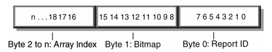

# 8. Report Protocol

## 8.1 Report Types

- Reports contain data from one or more items.

- Data transfers are sent from the device to the host through the Interrupt In pipe in the form of reports.

- Reports may also be requested (polled) and sent through the Control pipe or sent through an optional Interrupt Out pipe.

- A report contains the state of all the items (Input, Output or Feature) belonging to a particular Report ID.

- The software application is responsible for extracting the individual items from the report based on the Report descriptor.

 

- All of the items' values are packed on bit boundaries in the report (no byte or nibble alignment).

- However, items reporting Null or constant values may be used to byte-align values, or the Report Size may be made larger than needed for some fields simply to extend them to a byte boundary.

## 8.3 Report Format for Array Items

- Each button in an array reports an assigned number called an array index.

- This can be translated into a keycode by looking up the array elements Usage Pate and Usage.

- When any button transitions between open and closed, the entire list of indices for buttons currently closed in the array is transmitted to the host.

 

- Since only one array element can be reported in each array field, modifier keys should be reported as bitmap data (a group of 1-bit variable fields).

- For example, keys such as CTRL, SHIFT, ALT, and GUI keys make up the 8 bit modifier byte in a standard keyboard report.

- Although these usage codes are defined in the Usage Table as E0-E7, the usage is not sent as array data.

- The modifier byte is defined as follows.

|Bit|Key|
|-|-|
|0|LEFT CTRL|
|1|LEFT SHIFT|
|2|LEFT ALT|
|3|LEFT GUI|
|4|RIGHT CTRL|
|5|RIGHT SHIFT|
|6|RIGHT ALT|
|7|RIGHT GUI|

- The following example shows the reports generated by a user typing ALT+CTRL+DEL, using a bitmap for the modifiers and a single array for all other keys.

|Transition|Modifier Byte|Array Byte|
|-|-|-|
|LEFT ALT down|00000100|00|
|RIGHT CTRL down|00010100|00|
|DEL down|00010100|4C|
|DEL up|00010100|00|
|RIGHT CTRL up|00000100|00|
|LEFT ALT up|00000000|00|

> ##### See Also
>
> - For a list of standard keyboard key codes, see Appendix A: Usage Tags.

- If there are multiple reports for this device, each report would be preceded by its unique Report ID.

- If a set of keys or buttons cannot be mutually exclusive, they must be represented either as a bitmap or as multiple arrays.

## 8.4 Report Constraints

- The following constraints apply to reports and to the report handler:

    - Only one report is allowed in a single USB transfer.

    - A report might span one or more USB transactions.

    - Each top level collection must be an application collection and reports may not span more than one top level collection.

    - A report is always byte-aligned.

        - If required, reports are padded with bits (0) until the next byte boundary is reached.
